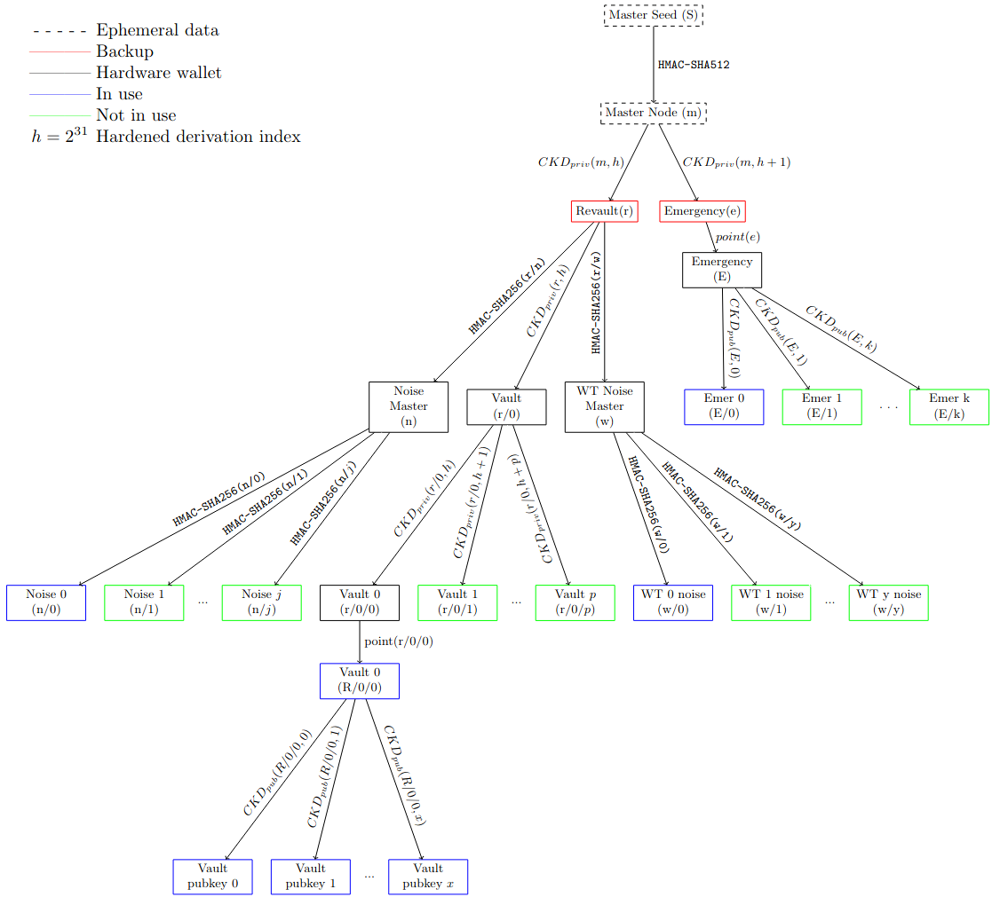
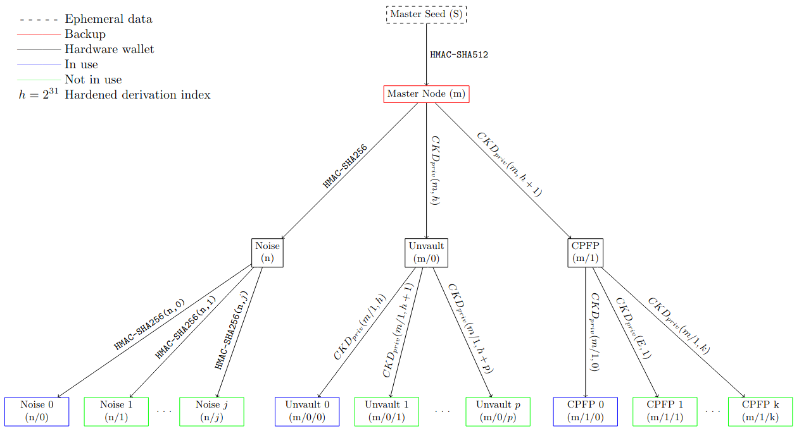

# Deployment Ceremony

## Motivation

Key management is fundamental to bitcoin custody. As an open-source, multi-party custody protocol, Revault builds on the strong foundation of a rigorous key-generation and key-agreement ceremony (referred to as the "ceremony") as the root of trust for the entire security infrastructure.

The accompanying documents discuss the list of devices and their state at each step for the stakeholders, managers, and a coordinator admin:

- [stakeholder deployment](stakeholder-deployment.md)
- [manager deployment](manager-deployment.md)
- [coordinator admin deployment](coordinator-admin-deployment.md)

The documents are concerned with how keys are generated and transported to the devices on which they will be stored. They ensure that each device is set-up with the correct software and configuration file, and that this is verifiable by the operating participant. The entire process is subject to strict controls to mitigate leakage of sensitive information and to avoid single points of failure.

It is critical that _confidentiality_ of secrets is maintained by secret-holders, and that secret-holders use backups to ensure _availability_ in case of losses and failures, and that the _integrity_ of secrets is verified during the ceremony (and from time to time afterwards). A forensic trail must be laid in case a critical failure occurs to help understand what went wrong and where legal liability falls.

By adhering to these deployment specifications, teams deploying Revault creates confidence in their ongoing custodial operations. Individuals can be confident that others in their team aren't naively cutting corners that could cause catastrohpic failures. With the inclusion of notaries or lawyers in the process, teams and their constituent individuals may aquire legal protection when failures occur.

## Vocabulary

- Participant: all participants in a Revault deployment will have one or two roles as a _stakeholder_ and/ or _manager_.
- Stakeholder: Controls a secret for the high-threshold multi-signature which is the primary protection for funds in custody.
- Manager: Controls a secret for funds which are delegated to them through unvault options
- Emergency Address (EA): An address independent from Revault wallet which is used in Revault's emergency deterrent feature to mitigate physical threats.
- Watchtower: Automated server to enforce unvault policies set by it's operator
- Coordinator Admin: _NOT A PARTICIPANT_, administrates the coordinator
- Coordinator: Automated server to reduce coordination complexity for communication
- Signing device: Offline signing device, with a firmware that supports Revault transactions

## Distributed Ceremony

To avoid a single point of failure, participants enact a _distributed_ ceremony. Each participant's wallet seed is created in isolation. The machines used in this process are destroyed before the (extended) public-key information is shared to other participants. Once each participant's personal root of trust (their signing device and their back-ups) are initialised with their wallet seed and physically secured, they can then meet the other participants to share their public-key data and verify that they generate the same set of policy descriptors.

Given the sensitivity of secrecy of the emergency policy, when sharing and verifying emergency public-key data stakeholders should meet each other without the presence of any other participant or entity.

## Key-Trees

Each participant generates a random seed in isolation, and from this constructs a hierarchical deterministic wallet as per [BIP-32](https://github.com/bitcoin/bips/blob/master/bip-0032.mediawiki). We rely on a combination of hardened derivation and non-hardened derivation where appropriate, to ensure that a compromise within a sub-tree is not catastrophic. We also opportunistically have branches in the tree where communication keys are derived. While these will be "hot" keys, stored on networked devices, this is helpful for evidence in the case of an incident (relying on back-ups), and it simplifies the set-up of infrastructure for and among participants.

First, let's consider a stakeholder's key-tree.

Given that stakeholders should have two segregated seeds for their participation in revault and emergency wallets, we have conceived of a method to avoid duplicating the seed generation process for them in order to simplify the process and reduce the operational burden. They generate a single, ephemeral random master seed, _S_, and input this into the "ceremony tool" software GUI. The software then derives from _S_ an ephemeral master node, _m_. Then it uses hardened derivation with two different indexes to generate independent Revault and Emergency key-tree roots, and displays them as seed phrases for the stakeholder to transcribe to two separate back-up media. The ceremony tool then derives three sub-tree roots to be stored on the signing device: Vault, Noise Master, and WT Noise Master.

The Vault represents the stakeholders' master bitcoin extended private-key. From this, the first Vault sub-tree is derived (Vault 0). This extended private-key is kept on the signing device, and the associated extended public-key is to be shared with other participants. In the event that the stakeholder needs to rotate to a new key-tree, the master Vault keys are used for hardened-derivation of the next sub-tree, Vault 1.

The Noise Master key is used to derive the first Noise key-pair used for secure communication channels with the stakeholder's Watchtower, and the coordinator server. As part of the set-up this will be transferred to the stakeholder's active laptop. A new key-pair can be generated from the master if rotation is needed.

The Watchtower Noise Master key is used to derive the first Watchtower Noise key-pair. As part of the set-up the derived key-pair will be transported to the Watchtower server. A new key-pair can be generated from the master if a new Watchtower instance should be deployed.

The Emergency sub-tree has it's own requirements. The Emergency master bitcoin extended private-key _must not_ be imported to the signing device. However, the Emergency master bitcoin public-key should be imported to the signing device. This can be used for non-hardened derivation of the Emergency public-keys (Emer 0, Emer 1, ...) that will be used to construct Emergency addresses. The motivation for requiring additional Emergency public-keys, despite them ideally never being used, is that the stakeholder could rotate to a new Emergency public-key in the event that there is a change in the set of stakeholders. This allows a new Emergency address to be constructed without accessing the Emergency back-up.

Next, let's consider the manager's key-tree.

Here, the manager generates an ephemeral random Master Seed, _S_. This is input into the ceremony tool software GUI. The software derives the Master Node, _m_, which is transcribed to the back-up media to be physically secured. The software derives three sub-trees: Unvault, Noise, and Child-pays-for-parent (CPFP).

Hardened-derivation is used for the Unvault sub-tree. The master bitcoin extended private-key is imported to the signing device. Hardened derivation is used to generate the first active instance of the Unvault branch used to construct the unvault descriptor. If there is a change in the participant set, this allows the manager to rotate to a new Unvault branch that is independent from the prior one such that no participant who has left will have access to the new unvault descriptor.

Hardened-derivation is used for the CPFP sub-tree. This is independent from the Unvault sub-tree in that compromising the extended private-key in either sub-tree won't automatically compromise the other. This is important because the CPFP sub-tree is likely to be a single-key hot-wallet used by the manager to bump the fee on Unvault and Spend transactions if needed. CPFP 0 is the first active instance of the CPFP branch. When there is a change in the participant set, the manager should rotate to using the next CPFP branch.

The Noise key is used to derive the first Noise key-pair (Noise 0) used for secure communication with the coordinator server. As part of the set-up this will be transferred to the manager's active laptop. A new key-pair can be generated from the sub-tree root if rotation is needed.

## Ceremony Controls

Let N be the number of participants. Let N_s and N_m be the number of stakeholders and managers respectively. Note that since a participant can take the role of both stakeholder and manager, that `N_s <= N <= N_s + N_m`.

- Seed generation in at least N distinct locations
- Seed generation by at least N distinct participants
- Log the procedure followed (every action) during the seed generation
- Use unique physical source of entropy for each master seed
- Destroy all devices that had direct access to any master seed
- Participants handle transport of any private material independently, and covertly
- Back-ups are physically secured, each in a unique location
- The entire life-cycle of each back-up (until a recovery scenario) is offline
- Back-ups are stored in tamper-evident packaging

